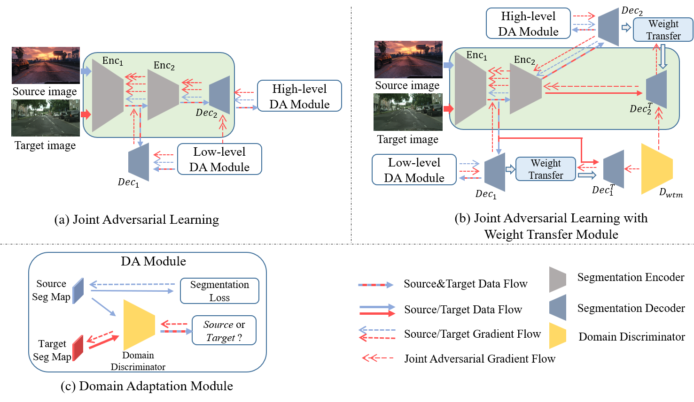
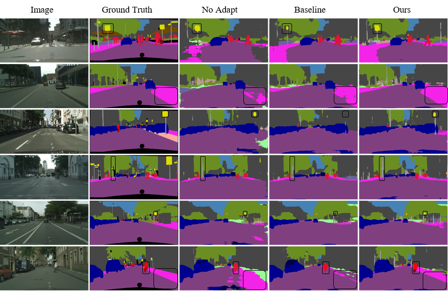
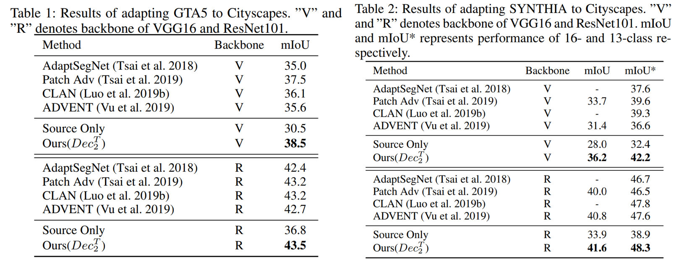

#  Joint Adversarial Learning for Domain Adaptation in Semantic Segmentation (AAAI2020)
A Pytorch Implementation of  [Joint Adversarial Learning for Domain Adaptation in Semantic Segmentation]((https://aaai.org/ojs/index.php/AAAI/article/view/6169)). 

## Framework



## Example Results


## Quantitave Results


## Introduction
Please follow [faster-rcnn](https://github.com/jwyang/faster-rcnn.pytorch/tree/pytorch-1.0) respository to setup the environment. In this project, we use Pytorch 1.0.1 and CUDA version is 10.0.130. 

## Datasets
### Datasets Preparation
* Download the [GTA5 Dataset](https://download.visinf.tu-darmstadt.de/data/from_games/) as the source domain, and put it in the `data/GTA5` folder

* Download the [Cityscapes Dataset](https://www.cityscapes-dataset.com/) as the target domain, and put it in the `data/Cityscapes` folder


## Models
### Pre-trained Models
In our experiments, we used two pre-trained models on ImageNet, i.e., VGG16 and ResNet101. Please download these two models from:
* **VGG16:** [Dropbox](https://www.dropbox.com/s/s3brpk0bdq60nyb/vgg16_caffe.pth?dl=0)  [VT Server](https://filebox.ece.vt.edu/~jw2yang/faster-rcnn/pretrained-base-models/vgg16_caffe.pth)
* **ResNet101:** [Dropbox](https://www.dropbox.com/s/iev3tkbz5wyyuz9/resnet101_caffe.pth?dl=0)  [VT Server](https://filebox.ece.vt.edu/~jw2yang/faster-rcnn/pretrained-base-models/resnet101_caffe.pth)

### Trained Models


## Train
```
bash ./experiments/scripts/jal_train.sh train ./configs/jal/GTA_Citsycapes_vgg16_train.xml
```


## Test
```
bash ./experiments/scripts/jal_train.sh test ./configs/jal/GTA_Citsycapes_vgg16_test.xml
```

## Citation
If you find this repository useful, please cite our paper:
```
@inproceedings{zhang2020joint,
  title={Joint Adversarial Learning for Domain Adaptation in Semantic Segmentation},
  author={Zhang, Yixin and Wang, Zilei},
  booktitle={Proceedings of the AAAI Conference on Artificial Intelligence},
  volume={34},
  number={04},
  pages={6877--6884},
  year={2020}
}
```
